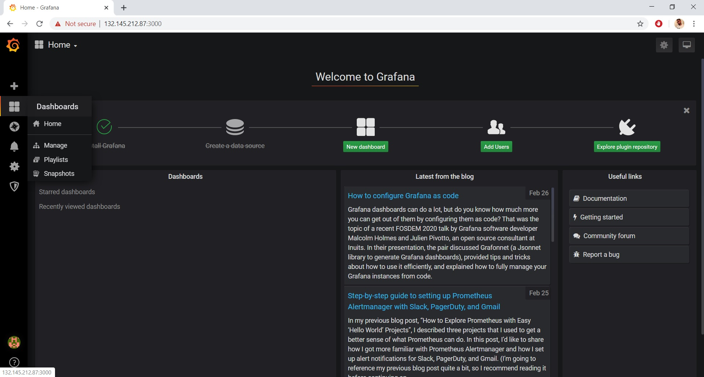
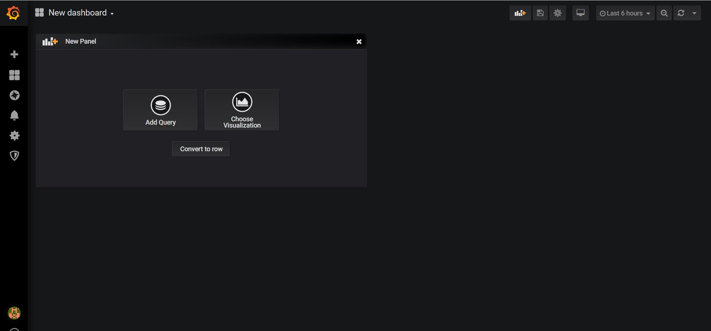
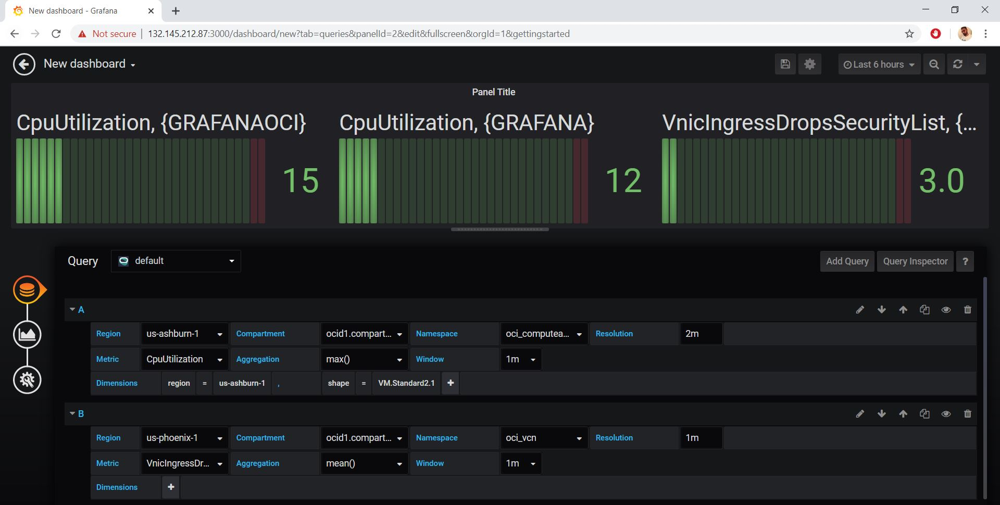
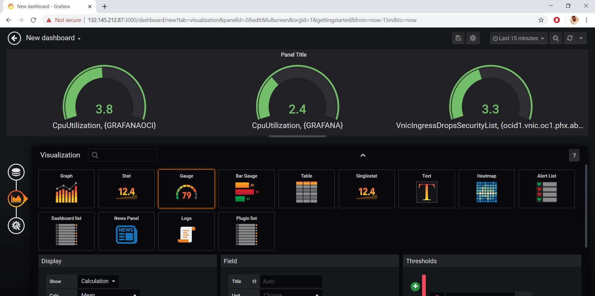
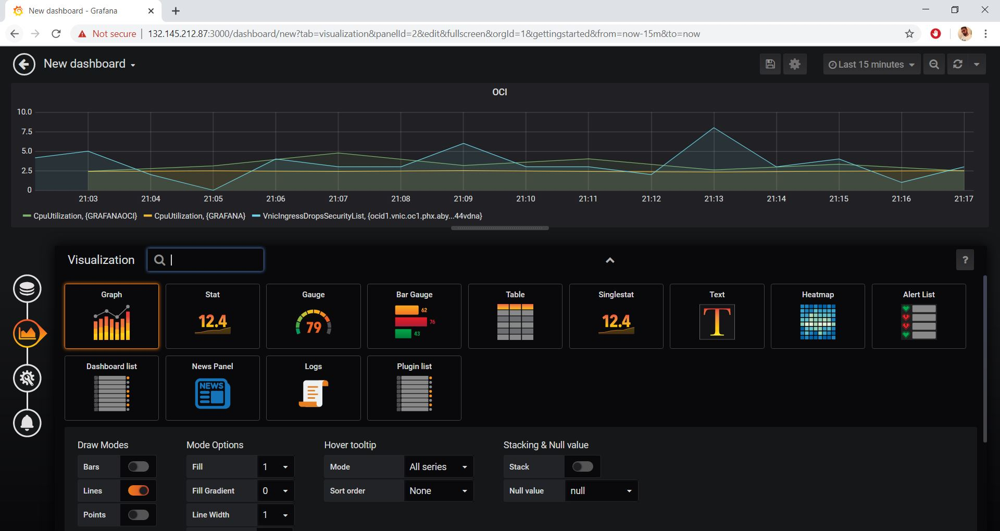
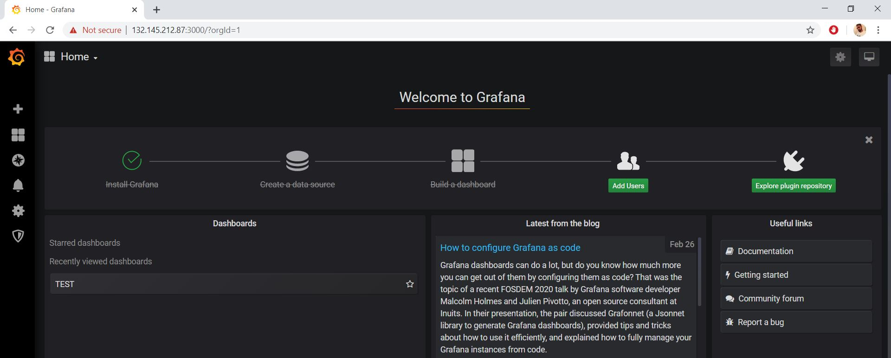
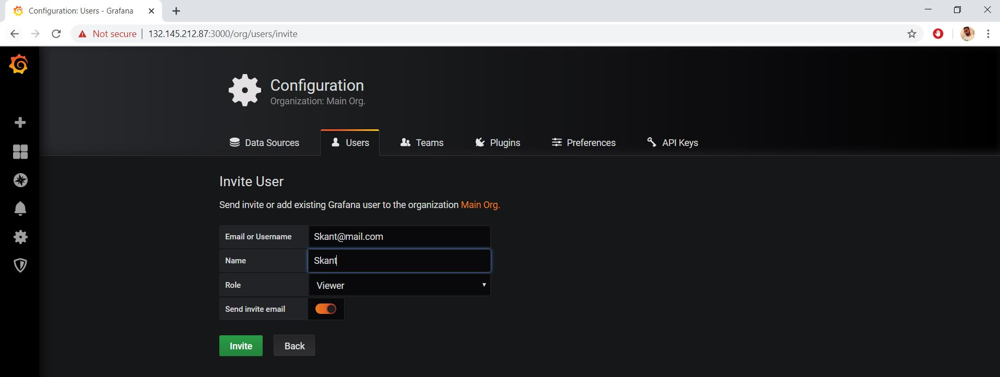

## bastion 에서 port forwarding 

```
firewall-cmd --permanent --zone=public --add-masquerade  
firewall-cmd --permanent --zone=public --add-port=3000/tcp 
firewall-cmd --permanent --add-forward-port=port=3000:proto=tcp:toaddr=10.0.0.216:toport=3000 
firewall-cmd --reload  
firewall-cmd --list-all
```


## oracle cloud policy 

dynamic-group 생성  : instancePrincipalGroup : grafana 정책 적용을 위한 설정 

```
allow dynamic-group instancePrincipalGroup to read metrics in tenancy
allow dynamic-group instancePrincipalGroup to read compartments in tenancy
```


## grafana 설치 

설치할 노드에 접근 

**grafana 설치 **

```
wget https://dl.grafana.com/oss/release/grafana-6.6.2-1.x86_64.rpm
yum localinstall grafana-6.6.2-1.x86_64.rpm

yum install fontconfig -y
yum install freetype* -y
yum install urw-fonts -y
```

**grafana service 활설화**

```
service grafana-server start
systemctl enable grafana-server
```

**방화벽 정책**

```
firewall-cmd --add-port=3000/tcp --permanent
firewall-cmd --reload
```

**초기 접속 정보**

```
URL : http://<Public IP>:3000
auth : admin/admin
```

## grafana  oci metric plugin 설치 

```
grafana-cli plugins install oci-metrics-datasource
systemctl restart grafana-server
```


## grafana 설정

데이타 소스 설정 

Configuration > Data Source > Add data source > oracle Cloud infrastructure Metrics 를 찾아가서 아래이 정보 입력한다

- Default  설정 on

- Tenancy OCID

- Default Region

- Environment


**New Dashboard**




**Add Query**




**Region, Compartment, Namespace, Metric and Aggreation**등의 메소드 작성 




**chart type을 선택한다**







**Add User**




새사용의 세부 권한 설정 




참고 : https://github.com/oracle/oci-grafana-metrics/blob/master/docs/linuxoci.md
