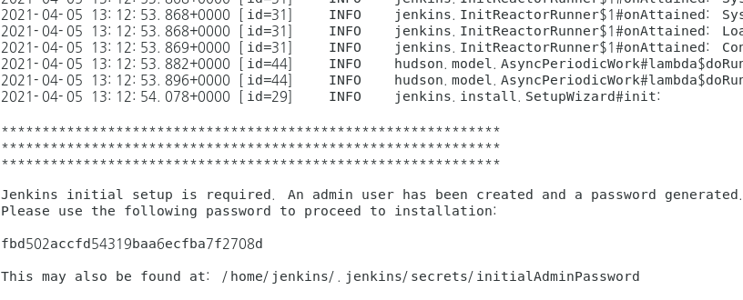
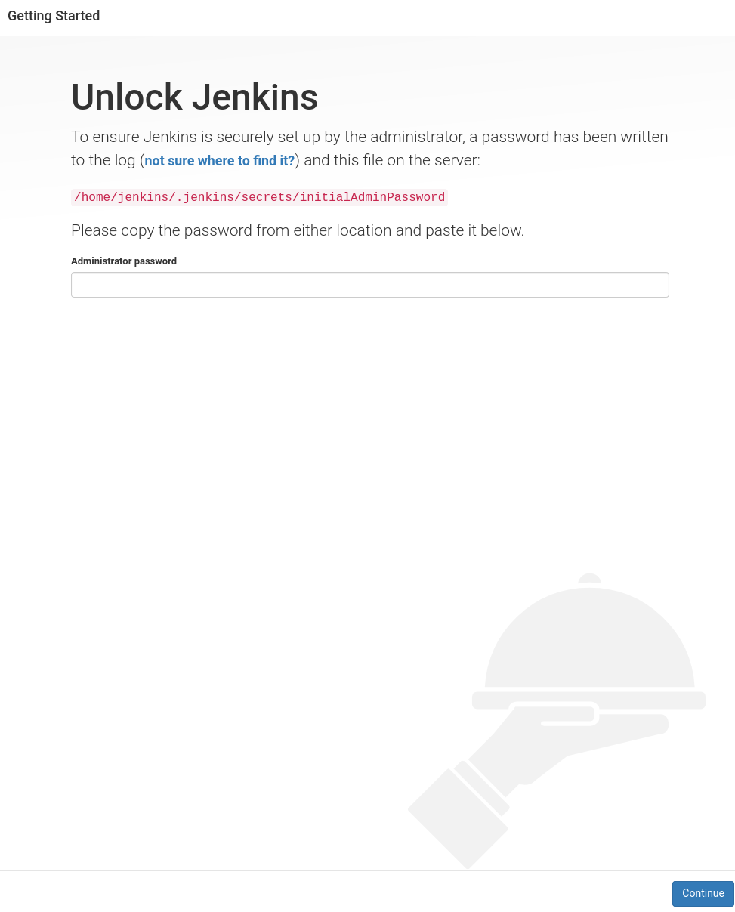
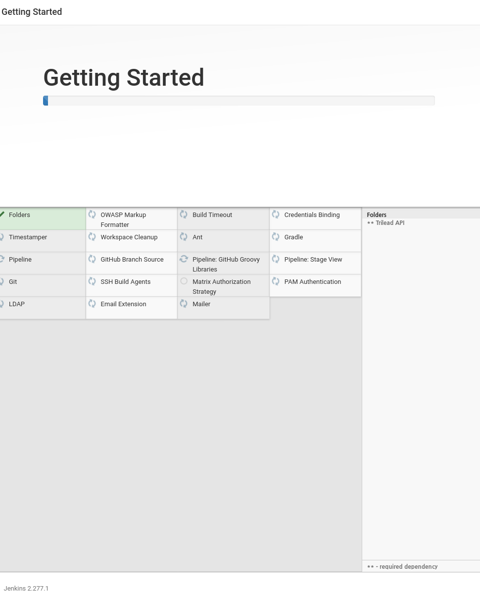
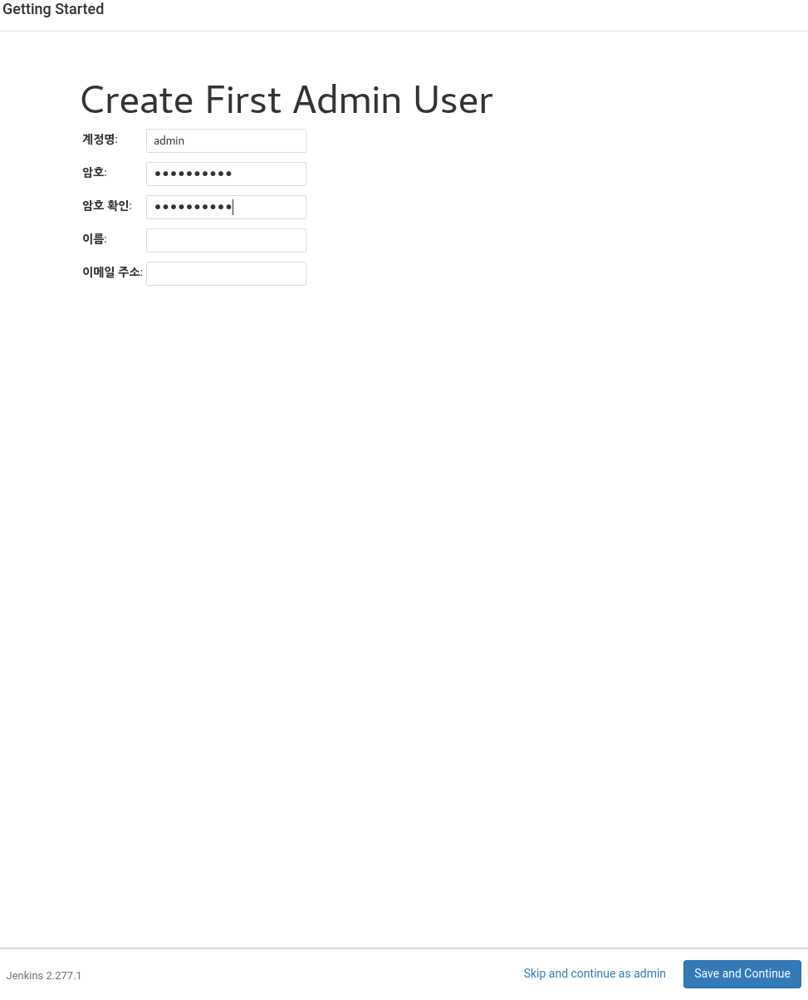
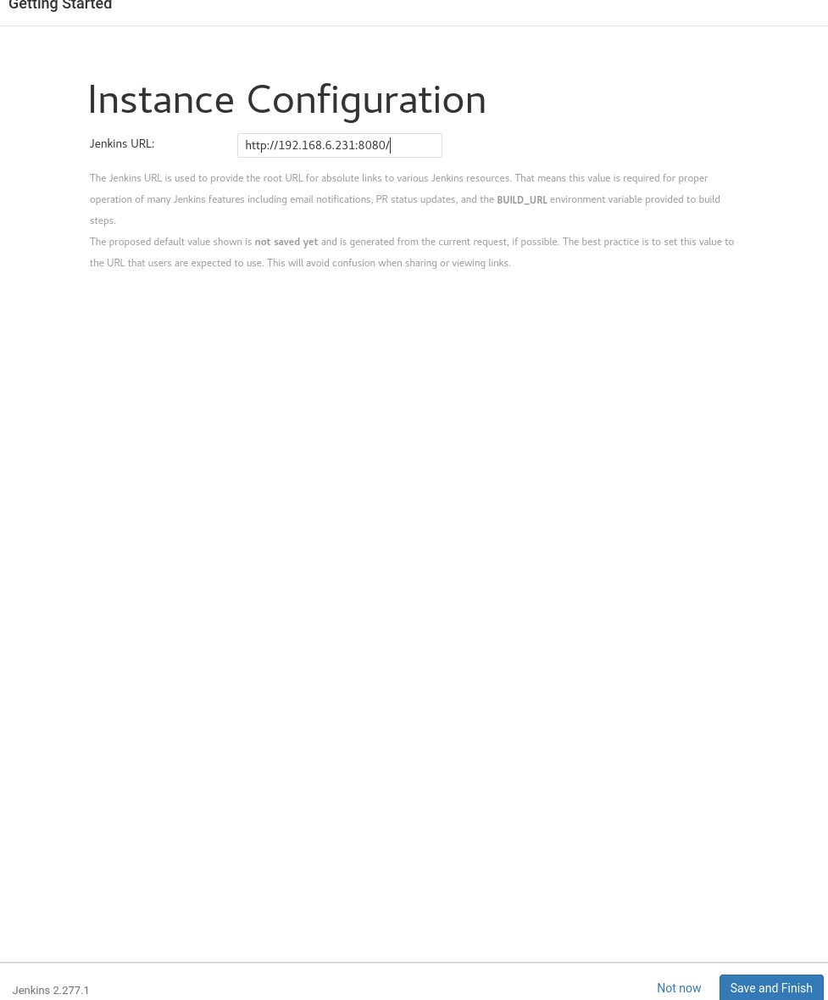
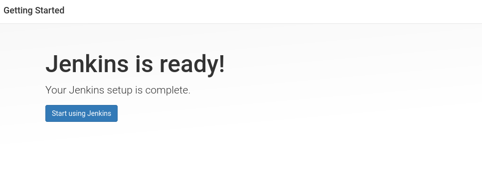

# Jenkins install 


## requiremnet

### OS 

```
yum update -y
yum install procps net-tools psmisc bind-utils wget
```


### java install

```
 yum install java-11*
```


### useradd

```
useradd jenkins
```


### Jenkins download

```
mkdir /opt/jenkins
chown jenkins.jenkins /opt/jenkins
su - jenkins
cd /opt/jenkins
wget https://get.jenkins.io/war-stable/2.277.1/jenkins.war
```


## install

### jenkins start

```
java -Xmx3G -Xms3G -server -XX:+UseParallelGC -XX:ParallelGCThreads=2 -XX:MaxPermSize=1G  \
                        -jar ./jenkins.war --httpPort=8080 \
                                           --httpListenAddress=0.0.0.0  \
                                           --httpsPort=8443 \
                                           --httpsListenAddress=0.0.0.0  \
#                        --ajp13Port=8009 \                          # jetty에서는 ajp지원 안함 
#                        --ajp13ListenAddress=127.0.0.1 \            # jetty에서는 ajp지원 안함 
#                        --prefix=jenkins \
#                        -Xmx3G -Xms3G -server -d64 -XX:+UseParallelGC \
#                        -XX:ParallelGCThreads=2 -XX:MaxPermSize=1G
```


### install configuration

**브라우저에서 http://ip-address/jenkins 로 접속** 

**접속 후 플러그인 설치에 대해 설정한다**


설치를 위한 unlock을 해야 한다 

**먼저 설치 화면에서 복사한 password를 복사한다**



**unlock page에 봍혀넣고 실행한다.**



**Plugin  설치가 진행 된다**




**admin 사용자 등록** 




**접속 주소 확인이 다음으로 넘어간다**




**설치 완료** 


