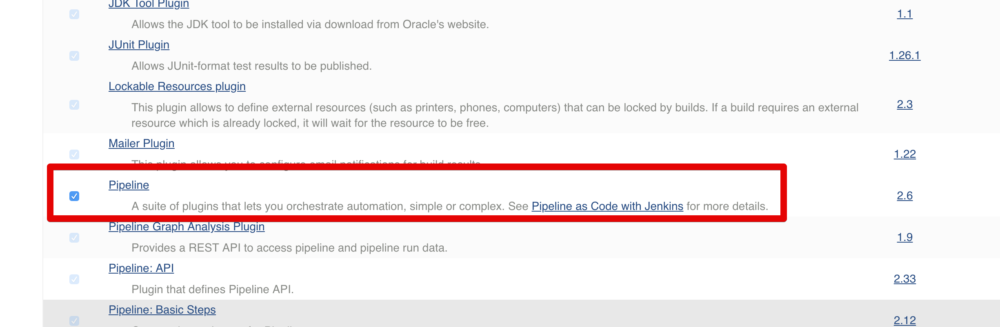
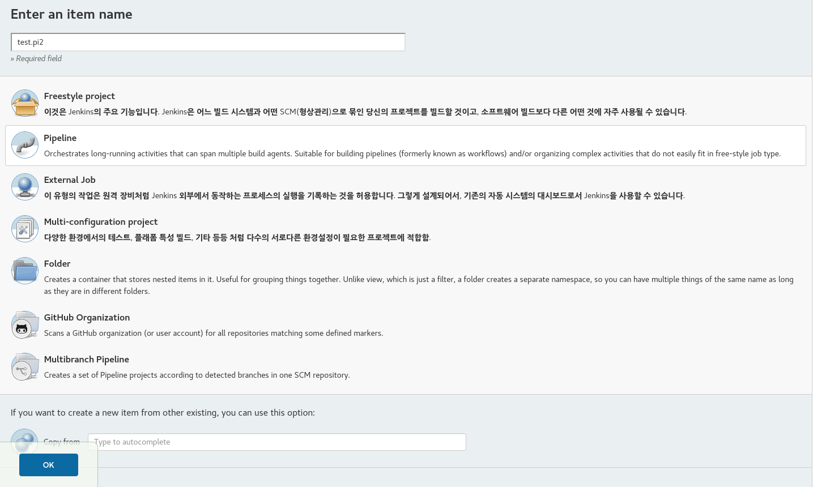
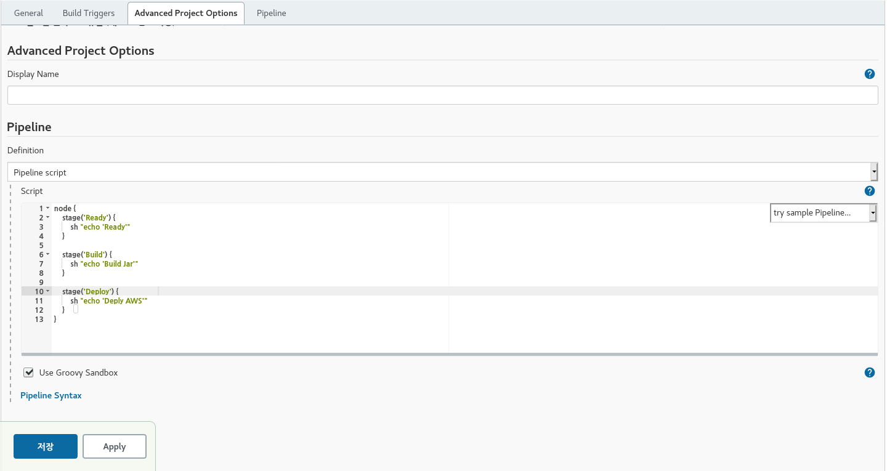

# jenkins pipeline 시작하기 

## 샘플 만들어 보기

### 플러그인 설치 확인 

jenkins 관리 > plugin 관리 >  **설치된 플러그인 **

**Pipeline**이 있으면 됩니다.

 

### pipeline  생성하기 

**dashboard에서 newitem 선택하여  pipeline 생성하기** 

**job설정 화면 하단으로 가면 pipeline 텝에 고드 작성**

 

**pipeline  생성 이후 실행** 

좌측 메뉴의 build now를 누르면 실행됩니다.

**성공시 아래와 같이 로그가 남음**

