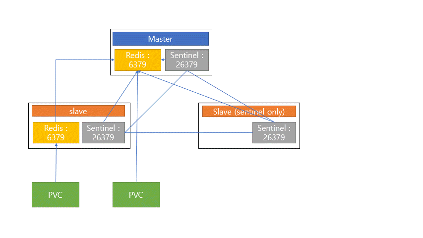

### redis sentinel 




### storage 

| namespace    | pvc                           | catacity |
| ------------ | ----------------------------- | -------- |
| rca-msa-dev  | pvc-rca-redis-sentinel-dev-0  | 10Gi     |
| rca-msa-dev  | pvc-rca-redis-sentinel-dev-1  | 10Gi     |
| rca-msa-stg  | pvc-rca-redis-sentinel-stg-0  | 10Gi     |
| rca-msa-stg  | pvc-rca-redis-sentinel-stg-1  | 10Gi     |
| rca-msa-prod | pvc-rca-redis-sentinel-prod-0 | 10Gi     |
| rca-msa-prod | pvc-rca-redis-sentinel-prod-1 | 10Gi     |


### Service

```
kind: Service
apiVersion: v1
metadata:
  name: redis-svc
  namespace: rca-msa-dev
spec:
  ports:
    - name: redis-sentinel
      protocol: TCP
      port: 6379
      targetPort: 6379
    - name: redis
      protocol: TCP
      port: 26379
      targetPort: 26379
  selector:
    app: rca-redis-sentinal
  clusterIP: None
  type: ClusterIP
  sessionAffinity: None
```


### configMap

| namespace    | configmap          | key                    |
| ------------ | ------------------ | ---------------------- |
| rca-msa-dev  | rca-redis-database | master.conf            |
|              |                    | slave.conf             |
|              |                    | post-init.sh           |
| rca-msa-dev  | rca-redis-sentinal | post-init.sh           |
|              |                    | run-redis              |
|              |                    | sentinel.conf          |
| rca-msa-stg  | rca-redis-database | master.confmaster.conf |
|              |                    | slave.conf             |
|              |                    | post-init.sh           |
| rca-msa-stg  | rca-redis-sentinal | post-init.sh           |
|              |                    | run-redis              |
|              |                    | sentinel.conf          |
| rca-msa-prod | rca-redis-database | master.confmaster.conf |
|              |                    | slave.conf             |
|              |                    | post-init.sh           |
| rca-msa-prod | rca-redis-sentinal | post-init.sh           |
|              |                    | run-redis              |
|              |                    | sentinel.conf          |


**rca-redis-database**

```
kind: ConfigMap
apiVersion: v1
metadata:
  name: rca-redis-database
  namespace: rca-msa-dev
data:
  master.conf: |
    # Apply this config only on the master.
    protected-mode no
    repl-ping-replica-period 10
    repl-timeout 60
    masterauth ${REDIS_PASSWORD}
  post-init.sh: |
    set -ex
    [[ `cat /etc/hostname` =~ -([0-9]+)$ ]] || exit 1
    ordinal=${BASH_REMATCH[1]}
    # Copy appropriate conf.d files from config-map to emptyDir.
    # cp /mnt/config-map/shared.conf /mnt/conf/redis.conf
    # ordinal 0 is the first host
    if [[ $ordinal -eq 0 ]]; then
      cp -Rp /mnt/config-map/..data/master.conf /tmp/
      envsubst < /tmp/master.conf >> /etc/redis.conf
      # cat /mnt/config-map/master.conf >> /etc/redis.conf
    else
      cp -Rp /mnt/config-map/..data/slave.conf /tmp/
      envsubst < /tmp/slave.conf >> /etc/redis.conf
      # cat /mnt/config-map/slave.conf >> /etc/redis.conf
    fi
  slave.conf: |
    # Apply this config only on slaves.
    # todo this should be parameterized with the actual hostname
    # slaveof redis-0.redis 6379
    protected-mode no
    replicaof rca-redis-sentinal-dev-0.redis-svc.redis.svc.cluster.local 6379
    repl-ping-replica-period 10
    repl-timeout 60
    masterauth ${REDIS_PASSWORD}
```


**rca-redis-sentinal**

```
kind: ConfigMap
apiVersion: v1
metadata:
  name: rca-redis-sentinal
  namespace: rca-msa-dev
data:
  post-init.sh: |
    cp -Rp /mnt/config-map/..data/sentinel.conf /tmp/
    envsubst < /tmp/sentinel.conf > /etc/redis.conf
    #sed -i "s/redis-server/redis-sentinel/g" /usr/bin/run-redis
  run-redis: >
    #!/bin/bash

    export_vars=$(cgroup-limits); export $export_vars

    source ${CONTAINER_SCRIPTS_PATH}/common.sh

    set -eu

    #[ -f ${CONTAINER_SCRIPTS_PATH}/validate-variables.sh ] && source
    #${CONTAINER_SCRIPTS_PATH}/validate-variables.sh

    # Process the Redis configuration files

    log_info 'Processing Redis configuration files ...'

    #if [[ -v REDIS_PASSWORD ]]; then #  envsubst <
    ${CONTAINER_SCRIPTS_PATH}/password.conf.template >> /etc/redis.conf #else # 
    log_info 'WARNING: setting REDIS_PASSWORD is recommended' #fi

    # Source post-init source if exists

    if [ -f ${CONTAINER_SCRIPTS_PATH}/post-init.sh ]; then
      log_info 'Sourcing post-init.sh ...'
      source ${CONTAINER_SCRIPTS_PATH}/post-init.sh
    fi

    # Restart the Redis server with public IP bindings

    unset_env_vars

    log_volume_info "${REDIS_DATADIR}"

    log_info 'Running final exec -- Only Redis logs after this point'

    exec ${REDIS_PREFIX}/bin/redis-sentinel /etc/redis.conf --daemonize no "$@"
    2>&1
  sentinel.conf: >
    # sentinel config

    port 26379

    protected-mode no

    sentinel monitor redis
    rca-redis-sentinal-dev-0.redis-svc.redis.svc.cluster.local 6379 2

    sentinel auth-pass redis ${REDIS_PASSWORD}

    sentinel down-after-milliseconds redis 5000

    sentinel failover-timeout redis 180000

    sentinel parallel-syncs redis 1
```


### Secrets

| namespace    | secrets | key   |
| ------------ | ------- | ----- |
| rca-msa-dev  | redis   | redis |
| rca-msa-stg  | redis   | redis |
| rca-msa-prod | redis   | redis |

**redis**

```
kind: Secret
apiVersion: v1
metadata:
  name: redis
  namespace: redis
data:
  redis: dGVzdA==
type: Opaque

```


### statefulset


**rca-redis-sentinal-dev**

```
kind: StatefulSet
apiVersion: apps/v1
metadata:
  name: rca-redis-sentinal-dev
  namespace: redis
spec:
  replicas: 2
  selector:
    matchLabels:
      app: rca-redis-sentinal
  template:
    metadata:
      creationTimestamp: null
      labels:
        app: rca-redis-sentinal
    spec:
      volumes:
        - name: config-map
          configMap:
            name: rca-redis-database
            defaultMode: 420
        - name: scriptes
          configMap:
            name: rca-redis-database
            items:
              - key: post-init.sh
                path: post-init.sh
            defaultMode: 420
        - name: config-map-s
          configMap:
            name: rca-redis-sentinal
            defaultMode: 420
        - name: scriptes-s
          configMap:
            name: rca-redis-sentinal
            items:
              - key: post-init.sh
                path: post-init.sh
            defaultMode: 420
        - name: scriptes-sr
          configMap:
            name: rca-redis-sentinal
            items:
              - key: run-redis
                path: run-redis
            defaultMode: 511
      containers:
        - resources:
            requests:
              cpu: 200m
              memory: 512Mi
          readinessProbe:
            exec:
              command:
                - /bin/sh
                - '-i'
                - '-c'
                - >-
                  test "$(/opt/rh/rh-redis5/root/usr/bin/redis-cli -h $(cat
                  /etc/hostname)  -a $REDIS_PASSWORD ping)" == "PONG"
            initialDelaySeconds: 15
            timeoutSeconds: 5
            periodSeconds: 10
            successThreshold: 1
            failureThreshold: 3
          terminationMessagePath: /dev/termination-log
          name: redis
          livenessProbe:
            exec:
              command:
                - /bin/sh
                - '-i'
                - '-c'
                - >-
                  test "$(/opt/rh/rh-redis5/root/usr/bin/redis-cli -h $(cat
                  /etc/hostname)  -a $REDIS_PASSWORD ping)" == "PONG"
            initialDelaySeconds: 15
            timeoutSeconds: 5
            periodSeconds: 10
            successThreshold: 1
            failureThreshold: 3
          env:
            - name: REDIS_PASSWORD
              valueFrom:
                secretKeyRef:
                  name: redis
                  key: redis
          ports:
            - name: redis
              containerPort: 6379
              protocol: TCP
          imagePullPolicy: Always
          volumeMounts:
            - name: pvc
              mountPath: /var/lib/redis/data
            - name: config-map
              mountPath: /mnt/config-map
            - name: scriptes
              mountPath: /usr/share/container-scripts/redis/post-init.sh
              subPath: post-init.sh
          terminationMessagePolicy: File
          image: 'registry.redhat.io/rhscl/redis-5-rhel7:latest'
        - resources:
            requests:
              cpu: 100m
              memory: 256Mi
          readinessProbe:
            exec:
              command:
                - /bin/sh
                - '-i'
                - '-c'
                - >-
                  test "$(/opt/rh/rh-redis5/root/usr/bin/redis-cli -h 127.0.0.1
                  -p 26379 -a $REDIS_PASSWORD ping)" == "PONG"
            initialDelaySeconds: 15
            timeoutSeconds: 5
            periodSeconds: 10
            successThreshold: 1
            failureThreshold: 3
          terminationMessagePath: /dev/termination-log
          name: redis-sentinel
          livenessProbe:
            exec:
              command:
                - /bin/sh
                - '-i'
                - '-c'
                - >-
                  test "$(/opt/rh/rh-redis5/root/usr/bin/redis-cli -h 127.0.0.1
                  -p 26379 -a $REDIS_PASSWORD ping)" == "PONG"
            initialDelaySeconds: 15
            timeoutSeconds: 5
            periodSeconds: 10
            successThreshold: 1
            failureThreshold: 3
          env:
            - name: REDIS_PASSWORD
              valueFrom:
                secretKeyRef:
                  name: redis
                  key: redis
          ports:
            - name: redis-sentinel
              containerPort: 26379
              protocol: TCP
          imagePullPolicy: Always
          volumeMounts:
            - name: config-map-s
              mountPath: /mnt/config-map
            - name: scriptes-s
              mountPath: /usr/share/container-scripts/redis/post-init.sh
              subPath: post-init.sh
            - name: scriptes-sr
              mountPath: /usr/bin/run-redis
              subPath: run-redis
          terminationMessagePolicy: File
          image: 'registry.redhat.io/rhscl/redis-5-rhel7:latest'
      restartPolicy: Always
      terminationGracePeriodSeconds: 30
      dnsPolicy: ClusterFirst
      securityContext: {}
      schedulerName: default-scheduler
  volumeClaimTemplates:
    - kind: PersistentVolumeClaim
      apiVersion: v1
      metadata:
        name: pvc
        creationTimestamp: null
        annotations:
          volume.alpha.kubernetes.io/storage-class: default
      spec:
        accessModes:
          - ReadWriteOnce
        resources:
          requests:
            storage: 20Gi
        volumeMode: Filesystem
      status:
        phase: Pending
  serviceName: redis-svc
  podManagementPolicy: OrderedReady
  updateStrategy:
    type: RollingUpdate
    rollingUpdate:
      partition: 0
  revisionHistoryLimit: 10
```


**rca-redis-sentinal-only-dev**

```
kind: StatefulSet
apiVersion: apps/v1
metadata:
  name: rca-redis-sentinal-only-dev
  namespace: redis
spec:
  replicas: 1
  selector:
    matchLabels:
      app: rca-redis-sentinal
  template:
    metadata:
      creationTimestamp: null
      labels:
        app: rca-redis-sentinal
    spec:
      volumes:
        - name: config-map-s
          configMap:
            name: rca-redis-sentinal
            defaultMode: 420
        - name: scriptes-s
          configMap:
            name: rca-redis-sentinal
            items:
              - key: post-init.sh
                path: post-init.sh
            defaultMode: 420
        - name: scriptes-sr
          configMap:
            name: rca-redis-sentinal
            items:
              - key: run-redis
                path: run-redis
            defaultMode: 511
      containers:
        - resources:
            requests:
              cpu: 100m
              memory: 256Mi
          readinessProbe:
            exec:
              command:
                - /bin/sh
                - '-i'
                - '-c'
                - >-
                  test "$(/opt/rh/rh-redis5/root/usr/bin/redis-cli -h 127.0.0.1
                  -p 26379 -a $REDIS_PASSWORD ping)" == "PONG"
            initialDelaySeconds: 15
            timeoutSeconds: 5
            periodSeconds: 10
            successThreshold: 1
            failureThreshold: 3
          terminationMessagePath: /dev/termination-log
          name: redis3-sentinel
          livenessProbe:
            exec:
              command:
                - /bin/sh
                - '-i'
                - '-c'
                - >-
                  test "$(/opt/rh/rh-redis5/root/usr/bin/redis-cli -h 127.0.0.1
                  -p 26379 -a $REDIS_PASSWORD ping)" == "PONG"
            initialDelaySeconds: 15
            timeoutSeconds: 5
            periodSeconds: 10
            successThreshold: 1
            failureThreshold: 3
          env:
            - name: REDIS_PASSWORD
              valueFrom:
                secretKeyRef:
                  name: redis
                  key: redis
          ports:
            - name: redis-sentinel
              containerPort: 26379
              protocol: TCP
          imagePullPolicy: Always
          volumeMounts:
            - name: config-map-s
              mountPath: /mnt/config-map
            - name: scriptes-s
              mountPath: /usr/share/container-scripts/redis/post-init.sh
              subPath: post-init.sh
            - name: scriptes-sr
              mountPath: /usr/bin/run-redis
              subPath: run-redis
          terminationMessagePolicy: File
          image: 'registry.redhat.io/rhscl/redis-5-rhel7:latest'
      restartPolicy: Always
      terminationGracePeriodSeconds: 30
      dnsPolicy: ClusterFirst
      securityContext: {}
      schedulerName: default-scheduler
  serviceName: redis-svc
  podManagementPolicy: OrderedReady
  updateStrategy:
    type: RollingUpdate
    rollingUpdate:
      partition: 0
  revisionHistoryLimit: 10

```

