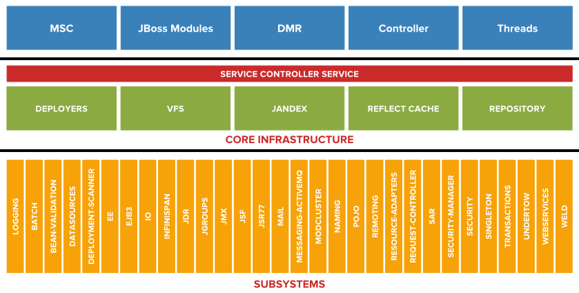
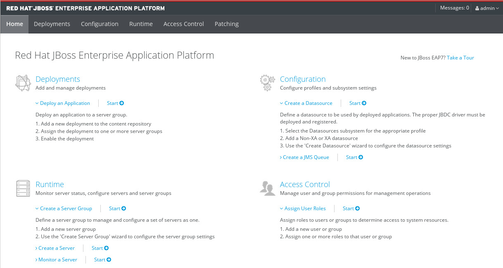

# 확장 프로그램 , 하위 시스템 및 프로필  

## 확장 프로그램과 하위 시스템 

> EAP 7은 WildFly Core 프로젝트에서 제공한 코어 인프라를 기반
>
> 모듈은 격리된 Classloader에 로드되고, 명시적인 요청을 받으면 다른 모듈의 클래스만 표시
>
> JBOSS_HOME/modules/system/layers/base 폴더에는 EAP 7 제품에서 제공하는 모듈이 들어 있습니다.
> EAP 7에 모듈을 추가하는 타사 제품은 JBOSS_HOME/modules/system/layers 내에 고유한 폴더 를 만듭니다.




>확장 기능 관리 모델은 관리 콘솔 및 관리 CLI를 통해 코어에서 제공한 관리 API를 사용하여 구성하고 관리할
>수 있는 하위 시스템을 하나 이상 제공합니다. 확장 기능이 EAP 인스턴스에 추가되면 확장 기능 관리 모델에
>서 제공한 하위 시스템의 기능과 특성이 EAP 구성 파일의 <subsystem> 요소 내에 구성됩니다.


**Extensions**

```
        <extension module="org.jboss.as.clustering.infinispan"/>
        <extension module="org.jboss.as.clustering.jgroups"/>
        <extension module="org.jboss.as.connector"/>
        <extension module="org.jboss.as.deployment-scanner"/>
        <extension module="org.jboss.as.ee"/>
        <extension module="org.jboss.as.ejb3"/>
        <extension module="org.jboss.as.jaxrs"/>
        <extension module="org.jboss.as.jdr"/>
        <extension module="org.jboss.as.jmx"/>
        <extension module="org.jboss.as.jpa"/>
        <extension module="org.jboss.as.jsf"/>
        <extension module="org.jboss.as.jsr77"/>
        <extension module="org.jboss.as.logging"/>
        <extension module="org.jboss.as.mail"/>
        <extension module="org.jboss.as.modcluster"/>
        <extension module="org.jboss.as.naming"/>
        <extension module="org.jboss.as.pojo"/>
        <extension module="org.jboss.as.remoting"/>
        <extension module="org.jboss.as.sar"/>
        <extension module="org.jboss.as.security"/>
        <extension module="org.jboss.as.transactions"/>
        <extension module="org.jboss.as.webservices"/>
        <extension module="org.jboss.as.weld"/>
        <extension module="org.wildfly.extension.batch.jberet"/>
        <extension module="org.wildfly.extension.bean-validation"/>
        <extension module="org.wildfly.extension.clustering.singleton"/>
        <extension module="org.wildfly.extension.core-management"/>
        <extension module="org.wildfly.extension.discovery"/>
        <extension module="org.wildfly.extension.ee-security"/>
        <extension module="org.wildfly.extension.elytron"/>
        <extension module="org.wildfly.extension.io"/>
        <extension module="org.wildfly.extension.messaging-activemq"/>
        <extension module="org.wildfly.extension.microprofile.config-smallrye"/>
        <extension module="org.wildfly.extension.microprofile.health-smallrye"/>
        <extension module="org.wildfly.extension.microprofile.opentracing-smallrye"/>
        <extension module="org.wildfly.extension.request-controller"/>
        <extension module="org.wildfly.extension.security.manager"/>
        <extension module="org.wildfly.extension.undertow"/>
        <extension module="org.wildfly.iiop-openjdk"/>


```


**subsystem**

```
batch-jberet                       
ee-security                        
jdr                                
microprofile-health-smallrye       
sar
bean-validation                    
ejb3                               
jmx                                
microprofile-opentracing-smallrye  
security
core-management                    
elytron                            
jpa                                
naming                             
security-manager
datasources                        
infinispan                         
jsf                                
pojo                               
transactions
deployment-scanner                 
io                                 
logging                            
remoting                           
undertow
discovery                          
jaxrs                              
mail                               
request-controller                 
webservices
ee                                 
jca                                
microprofile-config-smallrye       
resource-adapters                  
weld

```


예를 들면, org.jboss.as.jpa 확장 기능은 jpa 하위 시스템을 제공합니다. 이 하위 시스템 구성은 기본
적으로 제공되는 standalone.xml 구성 파일에서 다음과 같습니다.

```
<subsystem xmlns="urn:jboss:domain:jpa:1.1">
<jpa default-datasource="" default-extended-persistence-inheritance="DEEP"/>
</subsystem>
```


## **프로 파일 **

|name|profile|etc|

|:---:|:---:|:---:|

|default| logging, datasources, infinispan, jca, jsf, remoting, security, weld, batch-jberet, ejb3, jaxrs, mail, webserver, transaction, undertow | 대부분의 JEE 전체 프로필을 구현 |

|full| default, iiop-openjdk, jsr77, messaging-activemq | 주로 메시징(messaging-activemq)과 자주 사용되지 않는
다른 몇 가지 하위 시스템을추가 |

|ha| default, jgroups, modcluster, singleton | jgroups 하위 시스템에서 주로 제공하는 클러스터링을 추가 |

|full-ha| default, full, ha | 프로필과 동일하지만, 클러스터링 기능이 추가 |


# JBoss EAP 관리 

> JBoss EAP 관리를 위햐 사용할 수 있는 관리 옵션


## EAP 7 관리 옵션

### 설정 파일 위치 

```
standalone mode
#JBOSS_HOME/standalone/configuration/standalone.xml

domain mode
#JBOSS_HOME/domain/configuration/standalone.xml

```


### 설정을 위한 tool

```
1. 관리 콘솔: 브라우저를 사용하는 이 웹 기반 애플리케이션을 통해 시스템 관리자가 독립 실행형 또는 관
리형 도메인 배포 기능을 대부분 관리할 수 있습니다.

2. 관리 CLI(명령줄 인터페이스): 터미널 창을 사용하는 CLI는 특성을 보고 수정하며, 독립 실행형 서버 또
는 관리형 도메인에서 배치 작업을 포함한 작업을 수행할 관리 모델을 제공합니다. CLI에는 문맥 자동
완성, 기본 제공되는 서버 구성 특성 문서 및 명령 실행 내역과 같은 사용자에게 친숙한 기능이 포함되어
있습니다.

3. XML 구성 파일 수동 편집: 독립 실행형 서버 또는 관리형 도메인 설정은 직접 수정할 수 있는 XML 기반
구성 파일에서 유지 관리됩니다.
```


### 설정을 위한 tool 에 접속하는 방법 

**관리 콘솔**

http://localhost:9990 or http://xxx.xxx.xxx.xxx:9990 




**CLI access**

```
[root@jboss-eap-1 bin]# ./jboss-cli.sh --controller=host:9990 --user=[userid] --password=[password] --connect
[standalone@192.168.6.51:9990 /] :product-info
{
    "outcome" => "success",
    "result" => [{"summary" => {
        "host-name" => "jboss-eap-1.test.fu.igotit.co.kr",
        "instance-identifier" => "7bc98216-9e10-4e59-8dc6-1b613c0f22ec",
        "product-name" => "JBoss EAP",
        "product-version" => "7.2.0.GA",
        "product-community-identifier" => "Product",
        "product-home" => "/opt/app/EAP-7.0.2",
        "standalone-or-domain-identifier" => "STANDALONE_SERVER",
        "host-operating-system" => "Red Hat Enterprise Linux Server 7.9 (Maipo)",
        "host-cpu" => {
            "host-cpu-arch" => "amd64",
            "host-core-count" => 2
        },
        "jvm" => {
            "name" => "OpenJDK 64-Bit Server VM",
            "java-version" => "1.8",
            "jvm-version" => "1.8.0_272",
            "jvm-vendor" => "Red Hat, Inc.",
            "java-home" => "/usr/lib/jvm/java-1.8.0-openjdk-1.8.0.272.b10-1.el7_9.x86_64/jre"
        }
    }}]
}


종료를 위해서는   quit or q
```


**XML 직접 수정** 

$JBOSS_HOME/standalone/configuration/standalone.xml

$JBOSS_HOME/domain/configuration/domain.xml

해당 설정 파일을 직접 수정 

```
<server xmlns="urn:jboss:domain:4.1">
	<extensions>
		<extension module="org.jboss.as.clustering.infinispan"/>
		...
	</extensions>
	<management>
		...
	</management>
	<profile>
		<subsystem xmlns="urn:jboss:domain:logging:3.0">
	...
```


**관리자  생성**

```
$JBOSS_HOME/bin/add-user.sh

User Type(사용자 유형): 관리 사용자(a 옵션 선택) ## a -> admin , b -> application user
Username(사용자 이름): admin
Password(암호): JBoss@RedHat123
A List of groups that the user belongs to(사용자가 속한 그룹 목록): none(비워 둠)
Is this new user going to be used for one AS process to connect to another
AS process?(AS 프로세스 간에 연결하는 데 이 새 사용자를 사용합니까?): no

```

