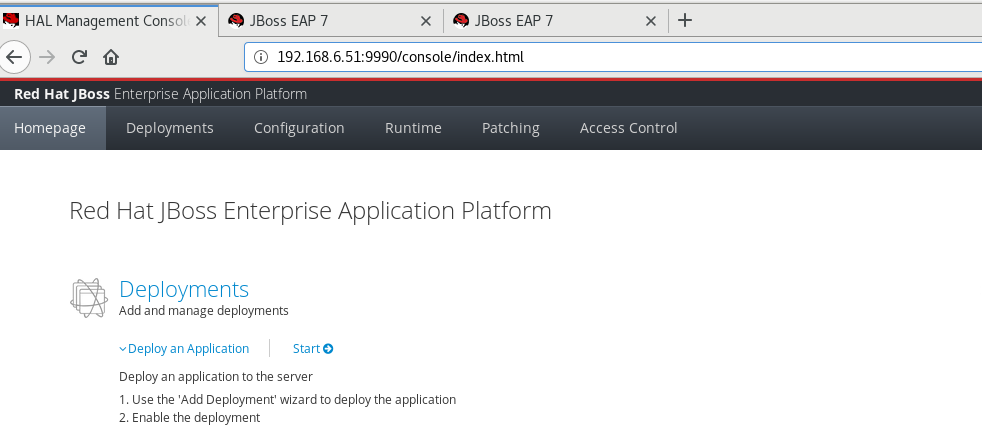
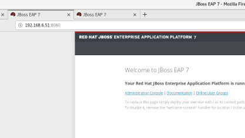
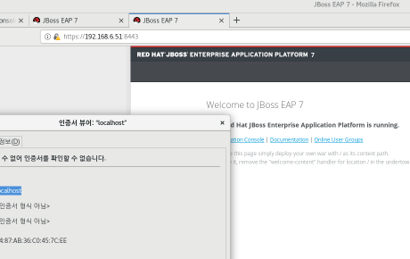

##  joss EAP 7.2  install

### 사전 설정 

**사용자 등록 **

```
# sudo useradd -r jboss
# id jboss
  UID가 1000이하인지 확인 
  
jboss 계정의 profile 수정 (~/.bashrc, ~/.bash_profile 중 하나)

추가 
... 
JBOSS_HOME=/opt/jboss-eap-7.xx # jboss 설치 위치 
PATH=$PATH:$JBOSS_HOME/bin
export JBOSS_HOME PATH

  
$JBOSS_HOME 의 위치가 jboss 사용자 및 그룹의 소유인지 확인 
```


**방화별 설정**

```
management

​	port : 9990    : http

​	Port : 9993     : https


public

​	Port : 8080    : http

​	Port : 8443     : https

​	Port : 8009     : ajp

```


### joss EAP 7.2  install - installer 

```
# java -jar jboss-eap-7.0.0-installer.jar
```


### joss EAP 7.2  install - rpm

```
# yum groupinstall jboss-eap7
```


### joss EAP 7.2  install - zip

```
# unzip jboss-eap-7.2.0.zip
```


## joss EAP 7.2  uninstall

### joss EAP 7.2  uninstall - installer 

```
# java -jar uninstaller.jar
```


### joss EAP 7.2  uninstall - rpm

```
# yum groupremove jboss-eap7
```


### joss EAP 7.2  uninstall - zip

```
# rm -rf jboss-eap-7.2
```


## ingtall cconfig

###  install config [installer intall]

```
# java -jar jboss-eap-7.2.0-installer.jar
Select your language below :
0: English
1: 中文
2: Deutsch
3: français
4: 日本語
5: português
6: español
Please choose [0] :
0
END USER LICENSE AGREEMENT
 RED HAT JBOSS(r) MIDDLEWARE(tm)
PLEASE READ THIS END USER
...
Copyright (c) 2013 Red Hat, Inc. All rights reserved. Red Hat, JBoss and the JBoss logo are registered trademarks of Red Hat, Inc. All other trademarks are the property of their respective owners.
press 1 to continue, 2 to quit, 3 to redisplay.
1

Select the installation path:  [/home/core/EAP-7.2.0]
/opt/app/EAP-7.0.2
press 1 to continue, 2 to quit, 3 to redisplay.
1


Select the packs you want to install:
1    [x] [Required]      [Red Hat JBoss Enterprise Application Platform] (30.73 MB)
2    [x]                 [AppClient] (39.72 KB)
3    [x]                 [Docs] (13.65 MB)
4    [x] [Required]      [Modules] (183.75 MB)
5    [x] [Required]      [Welcome Content] (2.16 MB)
Total Size Required: 230.34 MB
Press 0 to confirm your selections
Please select which packs you want to install
0
Pack Selection Done
press 1 to continue, 2 to quit, 3 to redisplay.
1

Create an Administrative User
This user will be added to the host container's management realm for administrative purposes. It can be used to access the management console, the management CLI, or other applications secured in this realm.

For minimal security, the password should be at least eight characters long, with one alphabetic character, one digit, and one non-alphanumeric symbol excluding "&".

Admin username: [admin]


Admin password: []
*******
Confirm admin password: [*******]
*******
Validation warning:
Password should have at least eight characters.
Password should have at least one digit.
Password should have at least one non-alphanumeric symbol.
press 1 to continue, 2 to quit, 3 to redisplay.
1

[ Starting to unpack ]
[ Processing package: Red Hat JBoss Enterprise Application Platform (1/5) ]
[ Processing package: AppClient (2/5) ]
[ Processing package: Docs (3/5) ]
[ Processing package: Modules (4/5) ]
[ Processing package: Welcome Content (5/5) ]
[ Unpacking finished. ]

Configure Runtime Environment
There are several additional options for configuring Red Hat JBoss Enterprise Application Platform now that the server has been installed. Each option can be individually chosen, and will be configured in the order displayed upon pressing "Next". What would you like to do now?
0  [x] Perform default configuration
1  [ ] Perform advanced configuration
Input Selection:
0

press 1 to continue, 2 to quit, 3 to redisplay.
1

[ Starting processing ]
Starting process Logging installation information (1/3)
IzPack variable state written to /opt/app/EAP-7.0.2/installation/InstallationLog.txt
Starting process Adding admin user (2/3)
Starting process Cleanup extraneous folders and tepmorary files (3/3)

Create shortcuts in the start menu (y/n) [y]:
y
Select a program group for the shortcuts: [JBoss Platform]:

[ Creating shortcuts ....... ]
Installation has completed successfully.
Application installed on /opt/app/EAP-7.0.2

Would you like to generate an automatic installation script and properties file? (y/n) [n]:
y
Select path for the automatic installation script: [/opt/app/EAP-7.0.2/auto.xml]

XML written successfully.
[ Console installation done ]
```


### zip intall

```
# sudo -u jboss /opt/jboss-eap-7.0/bin/standalone.sh

# sudo -u jboss /opt/jboss-eap-7.0/bin/add-user.sh
	User Type(사용자 유형): 관리 사용자(a 옵션 선택)
	Username(사용자 이름): admin
	Password(암호): @2xxxAqwead123
	A List of groups that the user belongs to(사용자가 속한 그룹 목록): none(비워 둠)
	Is this new user going to be used for one AS process to connect to another AS process?
	   (AS 프로세스 간에 연결하는 데 이 새 사용자를 사용합니까?): no
	   
# vi JBOSS_HOME/standalone/configuration/mgmtusers.properties
# vi JBOSS_HOME/domain/configuration/mgmtusers.properties
    admin 사용자가 있는지 확인 
```


```
설치 이후 
root로 설치시 jboss 구동 계정 으로 변경 

chown jboss.jboss #{JBOSS_HOME} -R
```


## jboss 구동 중지 


### 구동 

```

독립 실행형 서버인 경우:
$ ${JBOSS_HOME}/bin/standalone.sh

관리형 도메인 호스트 컨트롤러인 경우(마스터가 됨):
$ ${JBOSS_HOME}/bin/domain.sh
```


### 중지

```
• Ctrl+C를 사용 : 포그라운드로 실행시 
• kill 명령(Unix 및 OS X) 또는 GUI 작업 관리자를 사용하여 
      버 인스턴스(또는 호스트 컨트롤러) 프로 세스를 중지합니다.
      
• 관리 CLI를 사용
       /host=host3:shutdown (사용환경에 따라 달라짐 )
```


## Service Register 

```
# cp JBOSS_HOME/bin/init.d/jboss-eap-rhel.sh /etc/init.d/jboss-eap-rhel.sh

# cp JBOSS_HOME/bin/init.d/jboss-eap.conf /etc/default/jboss-eap.conf

# vi /etc/default/jboss-eap.conf

** 아래 내용 상황에 맞게 설정 **
	JAVA_HOME: /etc/alternatives/java_sdk(Java가 설치된 디렉터리)
	JBOSS_HOME:/opt/jboss-eap-7.0(EAP가 설치된 디렉터리)
	JBOSS_USER: jboss(EAP 프로세스 소유자)
	JBOSS_MODE:standalone(EAP를 시작할 모드(독립 실행형 또는 도메인))
	JBOSS_CONFIG:standalone.xml(프로세스에서 사용해야 하는 구성 파일)
	JBOSS_CONSOLE_LOG: /var/log/jboss-eap/console.log(모든 로그를 저장 할 파일)
	
# systemctl daemon-reload  # 시스템 daemon list 갱신

# systemctl enable jboss-eap # 시스템 daemon 자동 시작 등록 

# systemctl start jboss-eap # 시스템 daemon 구동 
```


## 접속 

### console 

url :  http://xxx.xxx.xxx.xx:9990



### http

url :  http://xxx.xxx.xxx.xx:8080



### https

url :  http://xxx.xxx.xxx.xx:8443

